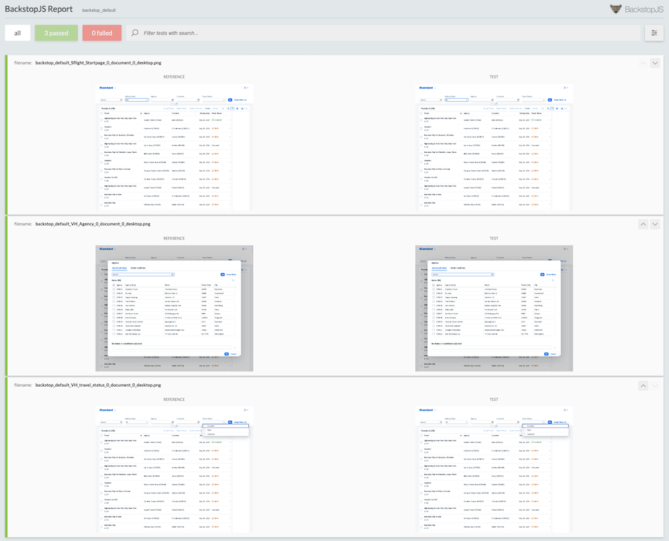

# Interactive-visual-regression-tests

## Step 3: Run UI tests

In this step the UI tests added in step  2 are executed against the baseline. As a result, no errors should be reported and the result report shown.

### Run visual regression test

```sh
npm test
```

### Result

