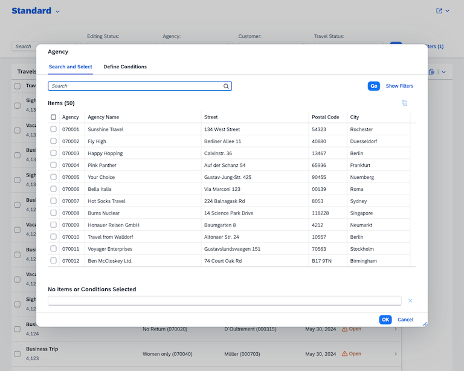
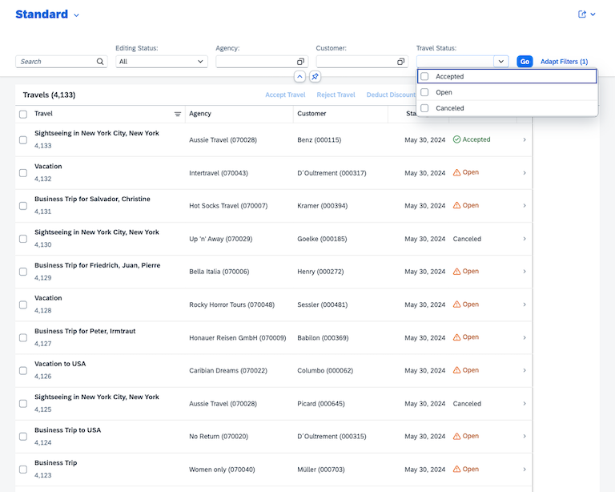
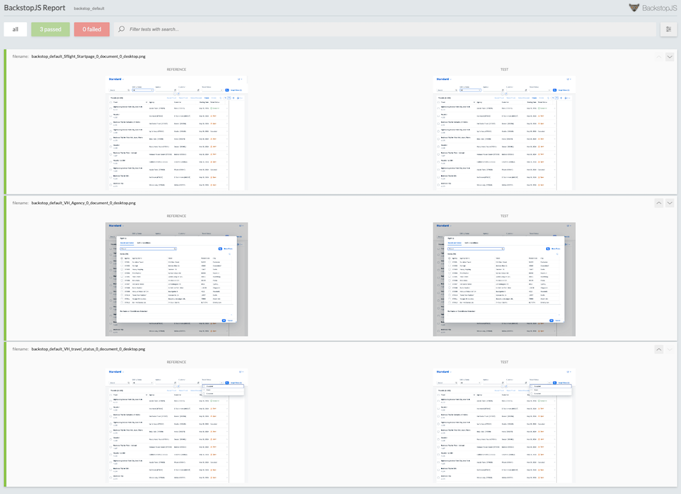

# Interactive-visual-regression-tests

This is a sample app to show how interactive visual regression testing can be used for testing web apps. More information about the approach and app created as an example can be found at the my blog post [Interactive visual regression tests]().

The recommended approach for going through the example is to read first the blog post and create the app in parallel by following the steps outlined in the blog post. This repository should be used as reference and help.

## Objective

The objective is to create a visual regression testing app that tests an app for visual changes. The UI controls tested include value help dialogs and table entries. To call these UI elements, the user must perform certain actions like clicking an element, or inserting values by keyboard. How these interactions can be recorded and used as the source for the regression tests is part of the blog post and this repository. The results of the test are presented in a report. The report displays errors in an easy to consume way, helping developers and end users to capture at a glance why tests failed.

## Tests

### Recording

The UI test recording for the examples 1 to 4 is the [SFLIGHT 1.json](https://github.com/tobiashofmann/sample-ui-test-recording/blob/main/SFLIGHT%201.json) file from the repository [sample-ui-test-recording](https://github.com/tobiashofmann/sample-ui-test-recording/tree/main). The file is created using the CHrome test recorder. Additional information on the test is described in my blog post [UI test recording](https://www.itsfullofstars.de/2024/09/ui-test-recording/)

## Example UI interactions

The test recording serves as the foundation for the BackstopJS tests. The value help for the agency input filter and for the travel status are called. In step 5 of the example, both filters are filled out with values and the table is filtered. The Chrome recording for step 5 is part of this repository in the corresponding branch.

### Agency Value Help dialog



### Dropdown list

]

## Example testing report



## Prerequisites

The app in this repository is the testing app. The app to be tested is [SAP CAP SFLIGHT Demo app](https://github.com/SAP-samples/cap-sflight). The demo app must be installed and run separately. The information on how to do this can be found in the repository of the demo app. To make it easier for the examples, I recommend to deactivate the built-in authentication of the demo app.

<details>
  <summary>Disable authentication for sample app!</summary>

File [package.json](https://github.com/SAP-samples/cap-sflight/blob/main/package.json)

Change the value for cds.requires.development to:

```json
"[development]": {
    "auth": "dummy"
}
```

</details>

## Excercises

| Step          | Description |
| ------------- | ------------|
| Prerequisites | [Start SFLIGHT Fiori Elements app](https://github.com/SAP-samples/cap-sflight) |
| Step 1:       | [Initialize project and BackstopJS](https://github.com/tobiashofmann/Interactive-visual-regression-tests/tree/1-initialize-project) |
| Step 2:       | [Add test for agency value help](https://github.com/tobiashofmann/Interactive-visual-regression-tests/tree/2-agency-vh-tests) |
| Step 3:       | [Run visual regression test](https://github.com/tobiashofmann/Interactive-visual-regression-tests/tree/3-run-ui-tests) |
| Step 4:       | [Add test for travel status value help](https://github.com/tobiashofmann/Interactive-visual-regression-tests/tree/4-travel-status-vh-tests) |
| Step 5:       | [Set filter values and trigger table update](https://github.com/tobiashofmann/Interactive-visual-regression-tests/tree/5-add-complex-test) |
