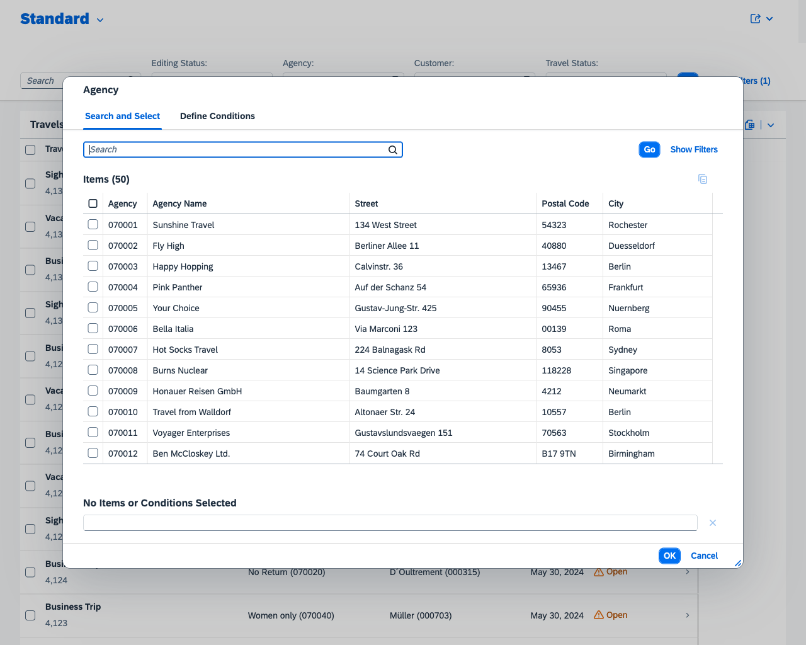

# Interactive-visual-regression-tests

## Step 2: Add tests to access homepage and open value help

In this step the first visual regression tests are added. The first test is simply checking if the startpage of the app loads. The second test is to check the value help for filter value agency.

Agency value help:



### Configure agency value help test

The following test scenario triggers a click on the value help of the agency filter and opens the value help dialog. Values to add to [backstop.json](backstop.json)

```json
{
    "label": "VH Agency",
    "url": "http://localhost:4004/travel_processor/webapp/index.html?sap-language=en",    
    "clickSelectors": [
    "#sap\\.fe\\.cap\\.travel\\:\\:TravelList--fe\\:\\:FilterBar\\:\\:Travel\\:\\:FilterField\\:\\:to_Agency_AgencyID-inner-vhi"
    ]
}
```

### Run test

```sh
npm test
```

### Create baseline

```sh
npx backstop approve
```