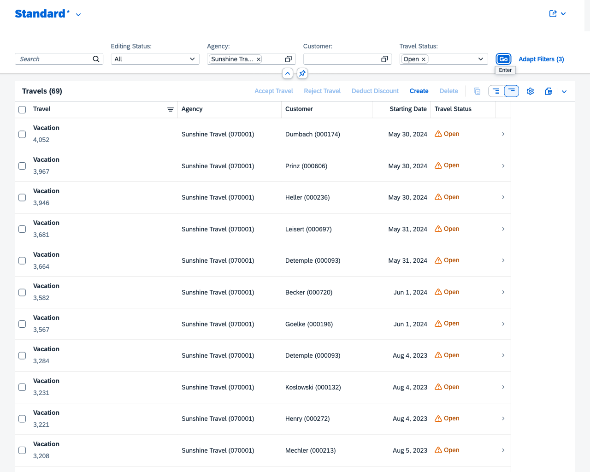

# Interactive visual regression tests

This is a sample app to show how interactive visual regression testing can be used for testing web apps. More information about the approach and app created as an example can be found at the my blog post [Interactive visual regression tests]().

The recommended approach for going through the example is to read first the blog post and create the app in parallel by following the steps outlined in the blog post. This repository should be used as reference and help.

## Step 5: Trigger actions to filter table

In this step a complex set of actions is performed to filter a table based on filter values. Here the "limitations" of the visual regression testing tool BackstopJS are shown. The so far used click selector performs all provided clicks on IDs one after another. Waiting for a given user flow to take part is out of scope.

To be able to trigger a complex action like several filters, a new UI test recording is used: instead of clicking the value help and selecting a value from the dialog, the filter value is entered by keyboard. The adjusted Chrome recording is in [SFLIGHT 3.json](SFLIGHT%203.json).

The adjustment in the test is to use keyPressSelectors, informing the input field ID and the value:

```json
"keyPressSelectors": 
[
    {
        "selector": "#sap\\.fe\\.cap\\.travel\\:\\:TravelList--fe\\:\\:FilterBar\\:\\:Travel\\:\\:FilterField\\:\\:to_Agency_AgencyID-inner-inner",
        "keyPress": "Sunshine Travel"
    },
    {
        "selector": "#sap\\.fe\\.cap\\.travel\\:\\:TravelList--fe\\:\\:FilterBar\\:\\:Travel\\:\\:FilterField\\:\\:TravelStatus_code-inner-inner",
        "keyPress": "Open"
    }
]
```

After filling out the filter values, the table filter action is applied:

```json
"clickSelectors": 
[
    "#sap\\.fe\\.cap\\.travel\\:\\:TravelList--fe\\:\\:FilterBar\\:\\:Travel-btnSearch-BDI-content"
]
```

This will set the filter values for agency and travel status and apply them. The filtered table will look like:



**Note**

  You can add the test for filtering the table to the existing backstop.json test scenarios. Or, like in this app, remove the test scenarios from the previous steps. This alows to focus only on the current test scenario: filter table.

## Run test

```sh
npm test
```

## Create baseline

```sh
npx backstop approve
```

## Validate UI tests

```sh
npm test
```

## Result report

