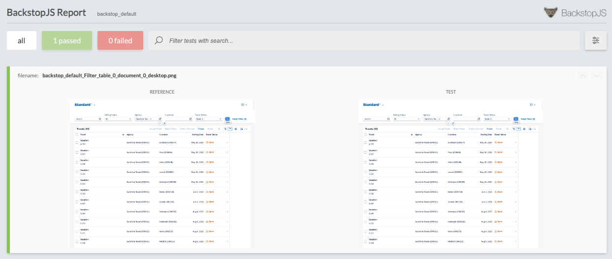

# Interactive visual regression tests

This is a sample app to show how interactive visual regression testing can be used for testing web apps. More information about the approach and app created as an example can be found at the my blog post [Interactive visual regression tests]().

The recommended approach for going through the example is to read first the blog post and create the app in parallel by following the steps outlined in the blog post. This repository should be used as reference and help.

## Step 4: Add test to open travel status code value help

In this step the test to open the value help of the travel status filter is added.

Travel status value help:


## Run test

```sh
npm test
```

## Create baseline

```sh
npx backstop approve
```

## Validate UI tests

```sh
npm test
```

## Result report

